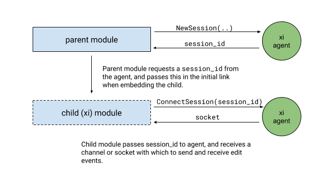
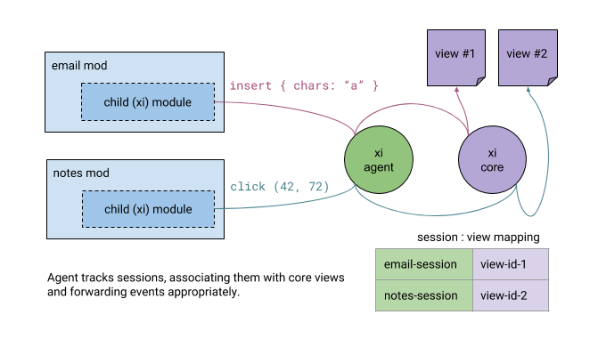

Xi Editor for Fuchsia
=====================

This directory contains the Fuchsia front-end modules for
[xi editor](https://github.com/xi-editor/xi-editor).

In addition to the code here, the Fuchsia xi-core service can be found in
//garnet/bin/xi, and shared widgets and models can be found in
//topaz/lib/xi.

> Status: Experimental

What exists here is primarily a simple text editor, written in Flutter.

# Structure

**xi_mod**: This the sample xi-editor Module.

**xi_embeddable**: This is a barebones editor module intended to be embedded
as a child view of other modules, without them having to deal with xi-core.
It coordinates with `xi_session_agent`.

**xi_session_agent**: An agent that opens a core connection and manages
editing sessions. Sessions can be created by any mod, and then connected
to by `xi_embeddable`, which handles the actual editing.

**xi_session_demo**: A demo mod that makes use of `xi_embeddable` and
`xi_session_agent`.

# Development

To build this package, make sure that the `//topaz/packages/prod/xi`
package is in your manifest.

# Embeddable Xi

_The following is an overview of 'Embeddable Xi', a project to demonstrate
how xi-editor could be used to provide generic text editing capabilities to
other mods_.

As part of ongoing work on the fuchsia text system, we wish to explore
providing a mod, backed by Xi, that can be embedded by other mods to 
provide convenient, full-featured text editing. 

This document focuses on the architecture of this service. 

## Background

[Xi-editor](https://xi-editor.io) is a highly flexible high performance
text editing system written in Rust, which is designed to be embedded by
various client applications, which can use it to implement anything that
needs to manipulate text.

Prior to this work, the only way to use xi-editor in fuchsia was to manually run
a xi-core process, and communicate with it directly. This is a high barrier
for many potential use-cases. Embeddable Xi is an attempt to simplify this,
and make it easy for a module to embed a child module which acts as a
text widget, and abstracts away most of the state management.

## Architecture

At a high level, we imagine two principal components; an agent, which 
manages a number of sessions (each session corresponding to an open 
buffer/document) and an embeddable module, which is started with a 
**session identifier** that it can use to establish a connection with 
the agent.

The agent owns a single instance of the xi-core process. Each session that
the agent is managing is backed by a separate view/buffer pair in xi-core.
The xi-core process is not exposed to the embedded module directly; 
the embedded module communicates with the agent, which forwards 
messages to xi-core:

### Sessions

A ‘session’ can be thought of as an ephemeral document managed by
`xi_session_agent`. Sessions are created by parent mods, and edited by
the `embeddable_xi` child mod. A parent can have multiple active sessions,
and can change which session is currently associated with a given child
by setting the child’s link. (_not implemented_)

### Lifecycle

When a parent module wants the user to enter some text, it first calls the
`NewSession` fidl method. This returns a session identifier; it passes
this identifier to the `xi_embeddable` module (via its link), and embeds
that module as a child. At any point (for instance in response to a button press)
it can fetch the contents of the buffer by passing the session identifier to
the `GetContents` fidl method. When it is finished with the session it can call
the `CloseSession` fidl method to clean up session state.